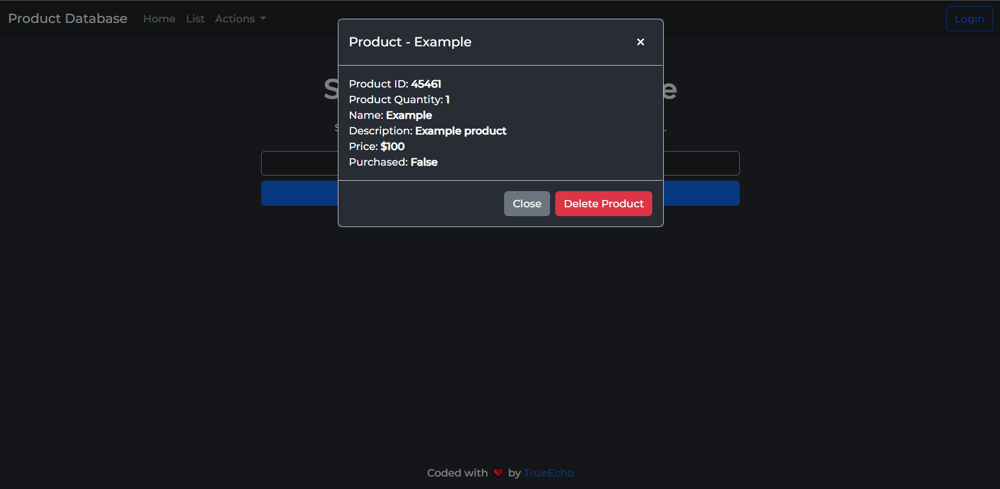

# Product Database
A simple product database that allows users to search, delete, create and list products. Using the following:

- MongoDB (Mongoose)
- ExpressJS (Javascript)
- EJS + HTML & CSS

### Features
The product database has a basic website built in allowing for the ability to create, delete and list products through either the certain pages. This is a project that I worked on for a class.

### Usage
To use an instance of the Product Database, Firstly change the ``_config.js`` file to ``config.js``. Then edit the mongoDB field with your Mongo Database URI, To obtain a free MongoDB server view [here](https://www.mongodb.com/cloud/atlas/register). Lastly run ``npm run build`` & ``npm run start``

### Preview
Lookup Page (Home) 
 

List Page 

Delete Page 
 
 

Create Page 
 
 

## License
[MIT](./LICENSE) 
Open to [contributions](./.github/contribute.md) and edits.

---
Coded with ❤ By TrueEcho.

